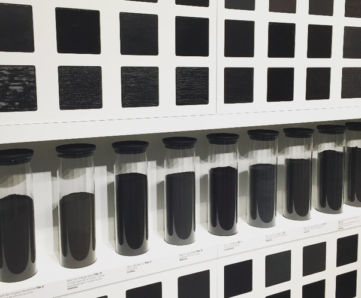

*Réponse publiée [sur Quora](https://fr.quora.com/Existe-t-il-des-nuances-de-noir/answer/Dr-Goulu)*

Oh que oui ! Allez voir une exposition de [Pierre Soulages](w:), qui a fait des centaines de toiles entièrement noires. Dans ses expos on trouve la collection de pigments noirs qu’il utilise

Evidemment il ne s'agit pas de noirs parfaits d'un point de vue physique, qui d'ailleurs n'existe pas. Tous ces pigments absorbent la lumière visible de manière partielle, en en réfléchissant ou diffusant tout de même un peu, et pas de manière uniforme dans le spectre ce qui cause la texture et les reflets qui intéressent Soulages.
