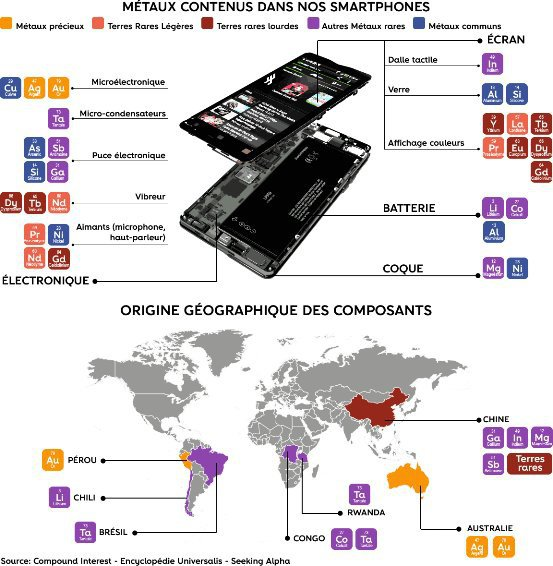

*Réponse publiée [sur Quora](https://fr.quora.com/D-o%C3%B9-provient-le-minerai-utilis%C3%A9-pour-la-fabrication-de-nos-appareils-%C3%A9lectroniques/answer/Dr-Goulu)*

[INFOGRAPHIE – D'où viennent les métaux rares contenus dans nos smartphones?](https://www.bfmtv.com/tech/infographie-d-ou-viennent-les-metaux-rares-contenus-dans-nos-smartphones-1534995.html) Fournit cette carte

