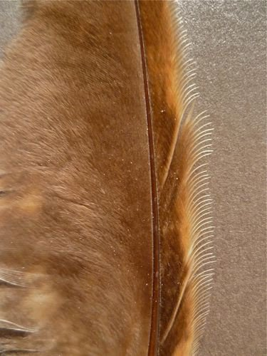

*Réponse publiée [sur Quora](https://fr.quora.com/Comment-le-hibou-est-capable-de-fendre-l-air-en-cr%C3%A9ant-%C3%A0-peine-un-murmure-de-perturbation-audible/answer/Dr-Goulu)*

Les plumes de beaucoup de rapaces nocturnes ont un bord d'attaque formé d'un peigne, et un bord de fuite duveteux.

[Primaires de Rapaces nocturnes - Alula](http://feathers-identification.over-blog.com/article-primaires-de-rapaces-nocturnes-101374693.html)

Le duvet absorbe l'énergie des turbulences, mais je n'ai pas trouvé d'explication de l'efficacité du peigne.

Une chose est sûre : si l'évolution l'a produit, c'est que ça marche.
