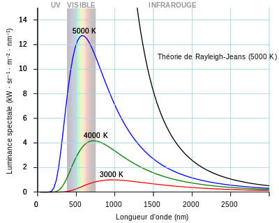
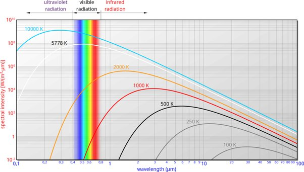

*Réponse publiée [sur Quora](https://fr.quora.com/%C3%80-quelle-temp%C3%A9rature-faut-il-chauffer-un-objet-pour-quil-n%C3%A9mete-plus-de-la-lumi%C3%A8re-visible-mais-des-ultra-violets/answer/Dr-Goulu)*

un corps chaud émet selon le spectre du [Corps noir:](w:Corps_noir)

qu’on voit mieux avec des échelles log :

(source : [Planck's law and Wien's displacement law - tec-science](https://www.tec-science.com/thermodynamics/temperature/plancks-law-of-blackbody-radiation/) )

Vous voyez que la température déplace le “pic” vers la gauche et qu’à partir de 10000K il se situe dans les UV, mais il y aura toujours une partie du spectre dans le visible. Même s’il est tellement chaud qu’il émet dans les X ou les gamma, il sera toujours visible.

Seuls les corps plus froids que ~700K n’émettent pas dans le visible, comme vous le confirmera votre plaque de cuisson.
