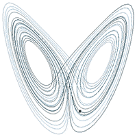

*Réponse publiée [sur Quora](https://fr.quora.com/Est-ce-qu-il-y-a-une-explication-scientifique-de-l-effet-papillon/answer/Dr-Goulu)*

Oui, l'[Effet papillon](w:) correspond à une bifurcation dans l'espace des phases d'un système chaotique.

Un système est dit "chaotique" si une toute petite perturbation (ou variation de ses conditions initiales) peut, dans certaines conditions, modifier beaucoup son évolution ultérieure.

Un des premiers systèmes chaotiques découverts est le [Système dynamique de Lorenz](w:) apparaissant en météorologie . Une simulation de l'évolution de ce système montre qu'il peut osciller autour de 2 "attracteurs" ou bifurquer de l'un à l'autre de manière quasi imprévisible :

Les axes x,y,z ne sont pas les dimensions de l'espace 3D, mais l' "état" du système dynamique : x représente l'intensité du mouvement de convection, y est différence de température entre les courants ascendants et descendants, et z l'écart du profil de température. Comme ces valeurs sont liées par des équations différentielles, on parle d' "espace d'état" ou d' "[Espace des phases](w:)".

L'effet papillon correspond à deux choses:

1. la forme des trajectoires de ce système particulier
2. l'idée qu'un battement d'aile de papillon au bon moment au bon endroit pourrait faire bifurquer le système d'un attracteur à l'autre, donc modifier beaucoup la météo future. Cette idée est aujourd'hui contestée : il faut une perturbation plus violente que ça…
