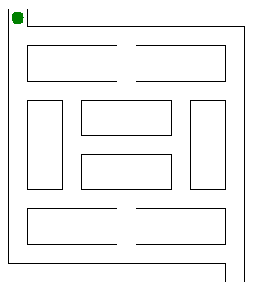

*Réponse publiée [sur Quora](https://fr.quora.com/Quel-algorithme-est-le-plus-efficace-pour-r%C3%A9soudre-un-labyrinthe-en-2D-puis-en-dimension-n/answer/Dr-Goulu)*

Ca dépend si vous "voyez" tout le labyrinthe ou juste là où vous êtes.

Si vous connaissez tout le labyrinthe, vous pouvez construire un graphe de toutes les "portes" et culs de sac :

puis recherche le chemin minimal entre votre position et la sortie avec un [Algorithme de Dijkstra](w:). Comme vous le voyez, cette méthode marche quel que soit le nombre de dimensions du labyrinthe.

Si vous n'avez qu'une vue locale, vous allez devoir explorer le labyrinthe… L'algorithme de la main gauche ne marche qu'en 2D et si le labyrinthe n'a pas d'île qui vous fait tourner en rond …

L'algorithme de Trémaux est celui qui marche le mieux à ma connaissance. Comme il n'était décrit qu'en anglais sur la Wikipédia, je viens de le traduire en français : [Résolution de labyrinthe - Algorithme de Trémaux — Wikipédia](w:Résolution_de_labyrinthe). Je en mets ici que la petite animation qui l'illustre :

Je ne suis pas absolument certain que ça marche en N dimension, mais au pif je dirais que oui ….

autre page intéressante [Modélisation mathématique de labyrinthe — Wikipédia](w:Modélisation_mathématique_de_labyrinthe)
