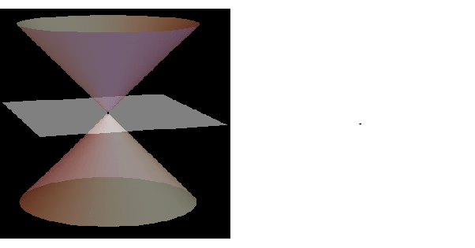

*Réponse publiée [sur Quora](https://fr.quora.com/Peut-on-consid%C3%A9rer-qu-une-ellipse-est-constitu%C3%A9e-de-2-paraboles-connect%C3%A9es-par-leurs-extr%C3%A9mit%C3%A9s/answer/Dr-Goulu)*

les ellipses, les paraboles et les hyperboles sont appelées des [Coniques](w:Conique) car elles correspondent aux intersections d'un plan avec un cône :

Ceci répond à votre question …
