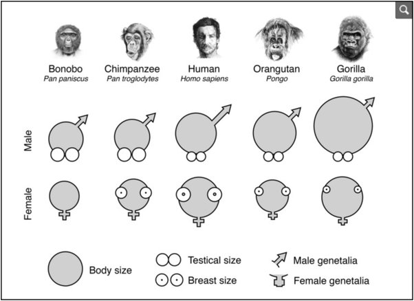

*Réponse publiée [sur Quora](https://fr.quora.com/Selon-toute-logique-la-s%C3%A9lection-naturelle-devrait-favoriser-l-%C3%A9mergence-d-une-population-masculine-dot%C3%A9e-d-un-membre-viril-de-plus-en-plus-grand-n-est-ce-pas/answer/Dr-Goulu)*

Pour le futur, je ne sais pas, mais pour le passé, ça a apparemment été le cas : les Homo Sapiens mâles ont les plus longs penis des primates, et les femelles les plus gros seins

[Les surprises de l’évolution](https://www.google.com/amp/s/jacqueshenry.wordpress.com/2017/02/15/les-surprises-de-levolution/amp/)
