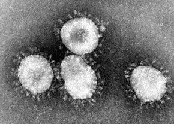
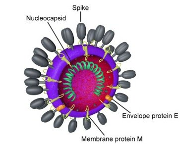

*Réponse publiée [sur Quora](https://fr.quora.com/Pourquoi-le-coronavirus-a-t-il-cette-forme-de-mine-marine/answer/Dr-Goulu)*

Le nom "[Coronavirus](w:)" vient de leur forme de couronne (= corona en latin, espagnol et bière mexicaine) sous le microscope électronique :

En réalité leur structure est effectivement une petite sphère hérissée de grosses protéines "S" comme "Spike" qui ont effectivement un point commun avec les pointes des mines marines : quand elles touchent une [Protéine d'adhésion cellulaire](w:) de la cellule cible, elle déclenchent le mécanisme du virus, qui injecte son ARN dans la cellule.

