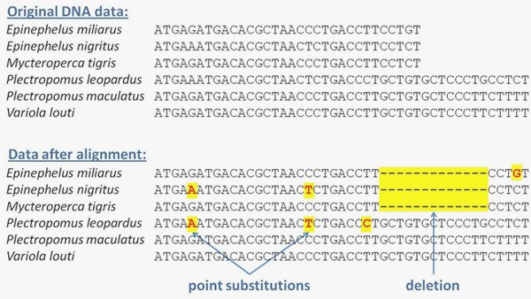

*Réponse publiée [sur Quora](https://fr.quora.com/Comment-la-radioactivit%C3%A9-peut-elle-provoquer-des-mutations-dans-les-%C3%AAtres-vivants/answer/Dr-Goulu)*

parce qu'un rayon gamma ou une particule alpha ou bêta peut casser l'ADN d'une cellule, et que les mécanismes de réparation peuvent se planter en le réparant.

Dans beaucoup de cas ça cause la mort de la cellule, dans quelques cas elle ne fonctionne plus correctement et peut causer un cancer par exemple.

Et puis dans quelques cas, par exemple sur des cellules sexuelles (gamètes) ou embryonnaires, ça provoque une mutation.

L'article [Mutations Are the Raw Materials of Evolution](https://www.nature.com/scitable/knowledge/library/mutations-are-the-raw-materials-of-evolution-17395346/) mentionne "radiation" comme source de mutation à la deuxième ligne et montre un exemple d'une petite séquence d'ADN de 6 poissons de la même famille après réalignement. On voit que des "lettres" sont parfois remplacées par d'autres, ou une petite séquence carrément supprimée… ou insérée :

