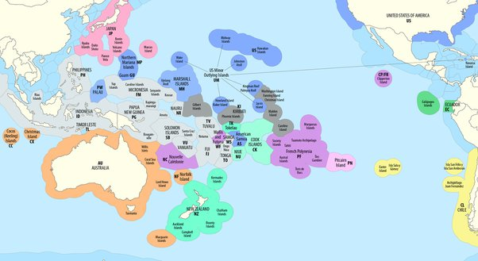

*Réponse publiée [sur Quora](https://fr.quora.com/Existe-t-il-une-carte-o%C3%B9-sont-mat%C3%A9rialis%C3%A9es-les-eaux-maritimes-de-chaque-pays/answer/Dr-Goulu)*

oui vous en trouverez même sur la wikipédia à partir de la page [Zone économique exclusive — Wikipédia](w:Zone_économique_exclusive)

par exemple pour le Pacifique :

