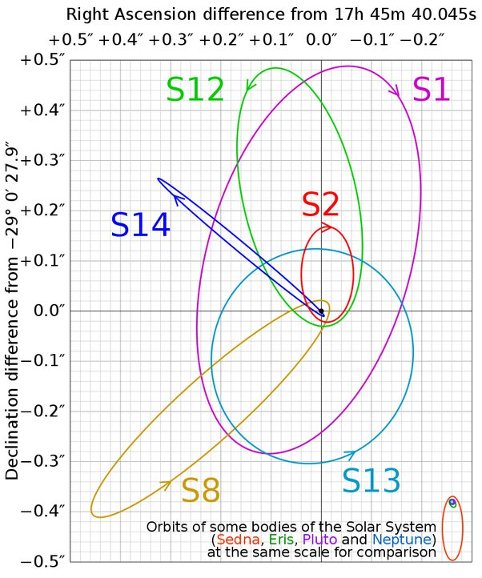

*Réponse publiée [sur Quora](https://fr.quora.com/Une-%C3%A9toile-qui-orbite-autour-d-un-trou-noir-sur-une-ellipse-proche-disons-10-ann%C3%A9es-lumi%C3%A8re-peut-elle-a-voir-un-syst%C3%A8me-plan%C3%A9taire-si-oui-comment-%C3%A7a-affecterait-la-vie-sur-cette/answer/Dr-Goulu)*

Comme dit [Brice Haziza](https://fr.quora.com/profile/Brice-Haziza) , à 10 années-lumière un trou noir stellaire est une étoile comme une autre, il n'y a aucune chance qu'une autre "orbite" autour.

Pour un trou noir supermassif, voici les trajectoires de quelques étoiles qui orbitent autour de [Sagittarius A*](w:), dont la masse est de 4 millions de masses solaires :

On voit que plusieurs ([S2](w:S2_(étoile)), S8, S12, S14) passent vraiment très près, à quelques heures-lumière du monstre, en se faisant accélérer à 2.5% de la vitesse de la lumière au passage…Elles survivent à l'effet de marée, ou de "spaghettification" comme on l'appelle parfois dans ce cas, mais il est probable que leurs planètes se soient fait éjecter depuis longtemps.

Par contre pour les étoiles plus lointaines avec des orbites moins excentriques comme S1 ou même S13, la perturbation gravitationnelle est faible, elles pourraient probablement avoir des planètes.

Par contre la vie là bas a intérêt à être résistante aux rayons X émis par le disque d'accrétion, et si l'orbite de l'étoile est fortement inclinée par rapport au trou noir, les passages à proximité des [Jets](w:Jet_(astrophysique)) du trou noir seraient très mauvais pour la santé. Ou même pour la planète elle-même …

article intéressant : [Stellar orbits near Sagittarius A*](https://academic.oup.com/mnras/article/331/4/917/1086002)
