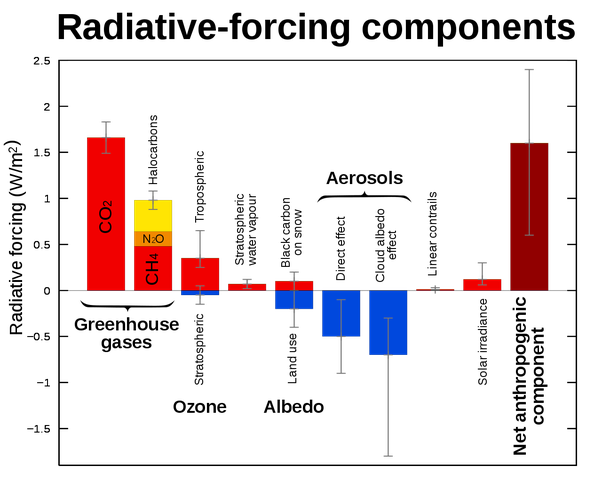

*Réponse publiée [sur Quora](https://fr.quora.com/Le-r%C3%A9chauffement-climatique-est-il-r%C3%A9ellement-caus%C3%A9-par-l-activit%C3%A9-humaine-ou-est-il-d%C3%BB-aux-cycles-naturels-de-glaciation-de-la-Terre-Quel-part-repr%C3%A9sente-chaque-facteur/answer/Dr-Goulu)*

Différence en 250 ans :

- Effets naturels 0.1 à 0.3 watts /m2
- Activité humaine : 0.6 à 2.4 watts/m2

[Forçage radiatif — Wikipédia](w:Forçage_radiatif)
