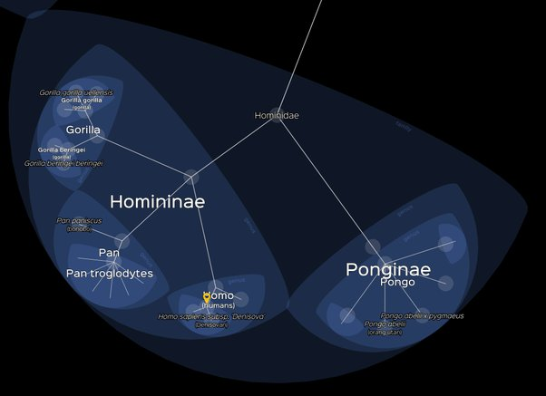

*Réponse publiée [sur Quora](https://fr.quora.com/Nous-sommes-des-mammif%C3%A8res-exactement-comme-tous-les-mammif%C3%A8res-et-nous-avons-95-d-ADN-en-commun-avec-les-chimpanz%C3%A9s-peut-on-dire-que-les-hommes-sont-une-race-particuli%C3%A8re-de-singes/answer/Dr-Goulu)*

[Homo sapiens](w:) n'est pas une "race". C'est une espèce de la tribu des [Hominini](w:) qui inclut les chimpanzés et les bonobos, de la sous-famille des [Homininae](w:) qui inclut les gorilles, et de la famille des [Hominidae](w:) qui inclut les orang-outans, de la super-famille des [Hominoidea](w:) qui inclut aussi les gibbons

C'est donc plutôt ces "grands singes" qui sont des espèces particulières d'Homquelquechose.

Et encore un p'tit coup de pub pour le génial [Lifemap](http://lifemap.univ-lyon1.fr/explore.html) de l'Université de Lyon :

