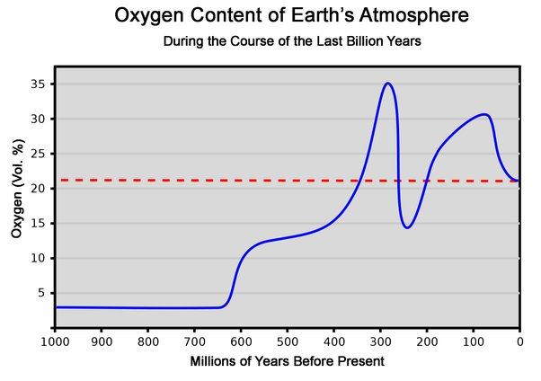

*Réponse publiée [sur Quora](https://fr.quora.com/A-l-%C3%A9poque-des-dinosaures-quelle-%C3%A9tait-le-taux-d-azote-et-d-oxyg%C3%A8ne-dans-l-air/answer/Dr-Goulu)*

5à 10% d'oxygène en plus qu'aujourd'hui, mais c'est assez incertain

[Histoire géologique de l'oxygène — Wikipédia](w:Histoire_géologique_de_l'oxygène)

