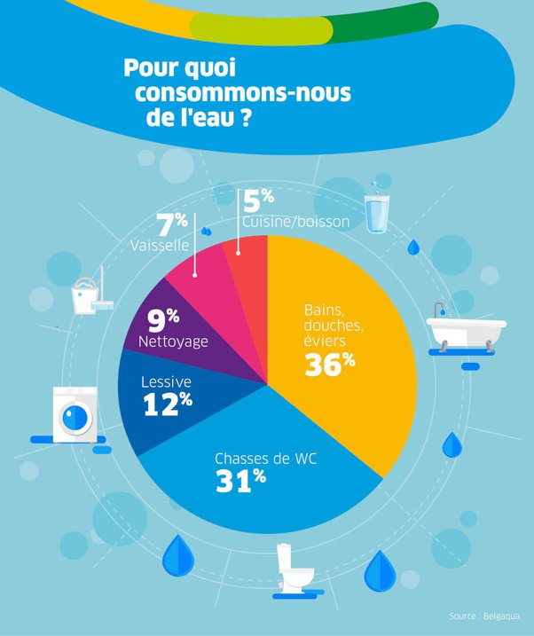

*Réponse publiée [sur Quora](https://fr.quora.com/Combien-de-r%C3%A9serves-naturelles-les-marques-deau-min%C3%A9rales-ont-elles-encore/answer/Dr-Goulu)*

La plupart des marques d'eau minérale n'exploitent pas la moitié de l'eau qui sort de leurs sources. A Evian, à 30 mins de bateau d'ici, les fontaines de la ville fournissent gratuitement l'eau de la même source que celle que vous pouvez acheter en Australie ou dans le désert de l'Atacama (vécu…). Et le reste coule dans le lac.

En gros, rien qu'en Suisse, tous les lacs sont remplis d'eau minérale. On pourrait vendre en bouteille pratiquement toute l'eau qui sort de toutes les sources des Alpes. Comme l'argument est surtout marketing, on n'exploite que les sources "thermales" qui ont une histoire et avec de l'eau aux "vertus curatives" hypothétiques, ou des teneurs en minéraux qui lui donnent un goût particulier.

Si vous avez peur de manquer d'eau un jour, dites-vous bien:

1. qu'on sait désaliniser l'eau de mer, et purifier à peu près n'importe quelle eau pour la rendre potable.
2. On en boit proportionnellement très peu (5% selon le graphique ci-dessous). L'eau "potable" sert surtout à transporter nos déchets de nos WC, douche, machine à laver à la station d'épuration.
3. D'ailleurs les astronautes pourraient très bien la consommer "en circuit fermé", mais pour des raisons psychologiques on leur envoie de l'eau propre à prix d'or.

Je viens de voir là [Infographie - Les ressources alternatives en eau (avec images) | Ressources, Gestion des eaux, Gestion des ressources naturelles](https://www.pinterest.fr/pin/478296422911448337/) qu'il y a environ 5000 m3 d'eau "douce et renouvelable" par habitant sur la Terre. 5 millions de litres … La consommation du Suisse moyen est de 109 m3. Le problème n'est donc pas là, il est dans la disponibilité de la ressource à certains endroits. Et effectivement à certains endroits, il vaudrait mieux utiliser de l'eau en bouteille que de faire un réseau d'eau propre pour les toilettes …

