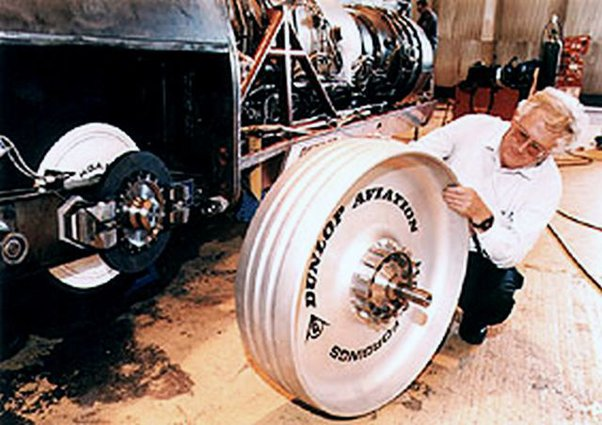

*Réponse publiée [sur Quora](https://fr.quora.com/Est-il-possible-que-nous-puissions-un-jour-courir-%C3%A0-la-vitesse-du-son-comme-Flash-dans-le-futur/answer/Dr-Goulu)*

Aucune chance. Les os se brisent bien avant sous l'effet de leur accélération (on est déjà proche de la limite), et il faut une puissance totalement hors d'atteinte rien que pour vaincre le frottement de l'air.

Ca , c'est une roue de [Thrust SSC](w:), le seul véhicule roulant qui a franchi le mur du son. En aluminium forgé. Ya pas de pneu, il serait déchiqueté par la force centrifuge. Derrière, on voit un des deux turboréacteurs qui sert à la propulsion…

