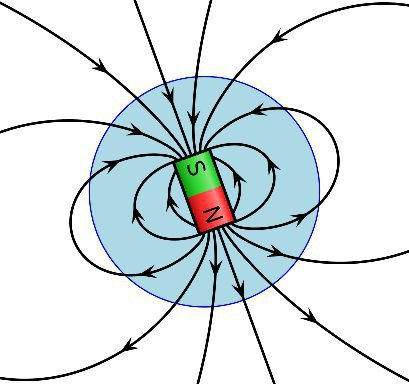
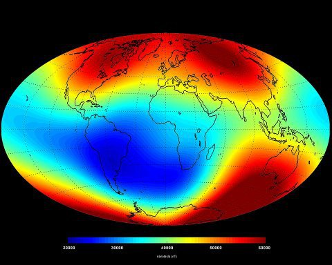
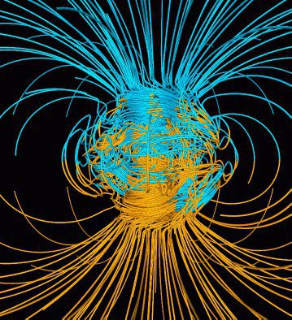

*Réponse publiée [sur Quora](https://fr.quora.com/Quelle-est-la-composante-horizontale-et-verticale-du-champ-magn%C3%A9tique-terrestre/answer/Dr-Goulu)*

Elle varie en chaque point.

En première approximation, le champ est perpendiculaire au sol près des pôles et tangent au sol près de l'équateur

En y regardant de plus près, c'est plus compliqué : le [Champ magnétique terrestre](w:)a une intensité variable

Et des lignes de champ très conplexes

(Source [Le champ magnétique terrestre](http://www.astrosurf.com/luxorion/terre-champ-magnetique.htm) sur AstroTurf)
