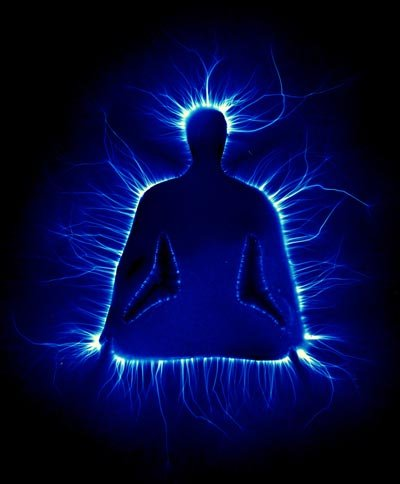

*Réponse publiée [sur Quora](https://fr.quora.com/Est-ce-quon-peut-devenir-capable-de-percevoir-son-propre-champ-%C3%A9nerg%C3%A9tique-dune-fa%C3%A7on-ou-dune-autre/answer/Dr-Goulu)*

Les "champs énergétiques" ça n'existe pas en physique.

C'est un truc de ["pratique énergétique](w:Pratique_énergétique)" , une pseudo-science pseudo-médecine 100% New Age qui emprunte des mots comme "énergie" ou "quantique" à la physique pour faire sérieux, mais c'est du vent. Et encore en disant "du vent" je suis sympa, parce que le vent a une réalité physique. "Vide" aussi d'ailleurs.

Bref non, on ne peut pas percevoir son "champ énergétique" ni celui de quelqu'un d'autre parce qu'on en a pas.

Evidemment y'en a qui vont vous montrer ça:

comme preuve de l'existence de l'[Aura](w:Aura_(parapsychologie)) etc. Mais c'est juste une [Photographie Kirlian](w:) exploitant l'[Effet corona](w:).
