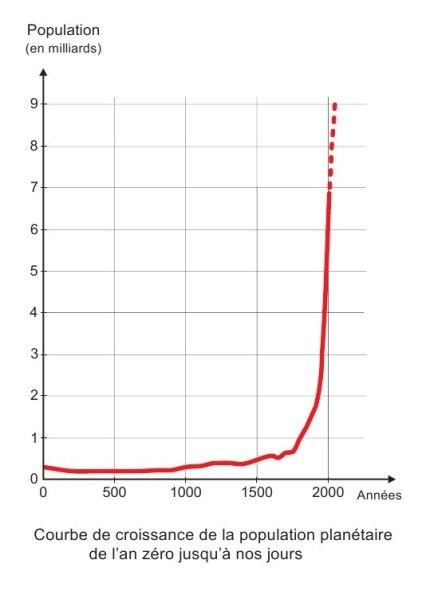

*Réponse publiée [sur Quora](https://fr.quora.com/Quelles-sont-les-civilisations-les-plus-respectueuses-de-la-nature-ecolo-Ou-qui-polluaient-le-moins/answer/Dr-Goulu)*

Celles où vous n'auriez pas aimé vivre. Avant 1900, il n'y avait aucun pays du monde où l'espérance de vie dépassait 50 ans, surtout en raison d'une mortalité infantile dramatique. 3/4 des enfants mouraient avant d'arriver à l'âge adulte, les femmes mourraient en couches une fois sur dix. Les gens qui survivaient à la peste, la variole, la rougeole, la lèpre, la syphilis et tous ces "fléaux de Dieu" craignaient le mauvais temps et les sauterelles qui pouvaient ruiner les récoltes et les faire mourir de faim.

Vous croyez que j'exagère ? Regardez ça :

Pourquoi croyez-vous que la population mondiale est restée quasi plate pendant des milliers d'années ? Parce qu'elle était soumise à la nature. Parfaitement écolo (enfin presque, parce qu'on a retrouvé la pollution au plomb de l'Antiquité dans les glaces de l'Antarctique).

Toutes les civilisations qui nous ont précédés étaient "écolo", mais elle n'avaient pas le choix. Ensuite, pratiquement toutes les populations de la Terre ont choisi de vivre mieux, plus longtemps et plus nombreux, au prix de véhicules motorisés, d'engrais et d'antibiotiques. Sauf les [Sentinelles](w:Sentinelles_(peuple)) et quelques tribus d'Amazonie peut-être. Les autres ont des T-shirts, des scooters et des téléphones portables.

La vraie question est de savoir si on peut vivre aussi nombreux, aussi longtemps, et en aussi bonne santé en étant plus écolos. Je ne sais pas, on verra.
