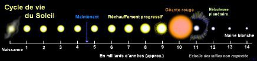

*Réponse publiée [sur Quora](https://fr.quora.com/Le-soleil-dispara%C3%AEtra-t-il-un-jour/answer/Dr-Goulu)*

Ça dépend ce que vous appelez disparaître. A court terme, l'évolution du [Soleil](w:)sera celle-ci :

La [Naine blanche](w:)émettra de la lumière visible pendant 10^67 ans environ avant de devenir une [Naine noire](w:).

La vous comprenez pourquoi j'ai parlé de "court terme" plus haut…
