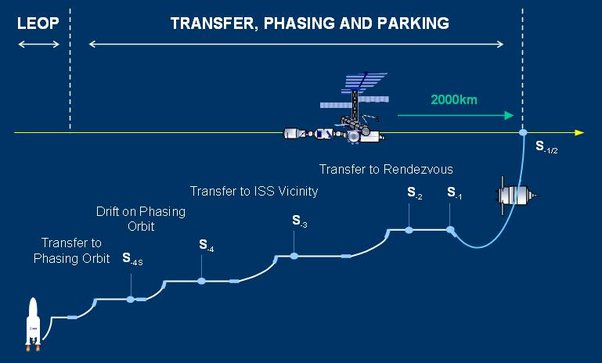

*Réponse publiée [sur Quora](https://fr.quora.com/Comment-faut-il-une-fus%C3%A9e-%C3%A0-des-vitesses-folles-si-longtemps-pour-se-rendre-%C3%A0-l-ISS-alors-qu-un-avion-peut-parcourir-23-fois-la-distance-en-moins-de-temps/answer/Dr-Goulu)*

La fusée doit accélérer à 28000 km/h pour rejoindre l'ISS sur son orbite avec 2 ou 3 km/h de marge d'erreur. Il vaut mieux faire ça en douceur.

D'ailleurs la trajectoire se fait par paliers successifs

[https://exploration.destination-...](https://exploration.destination-orbite.net/stations-spatiales/logistique.php)
