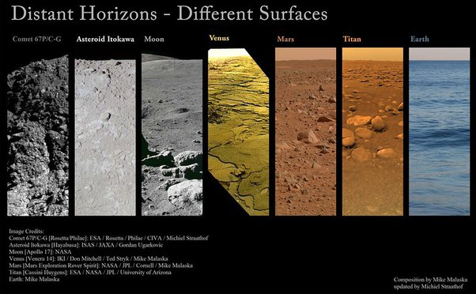

*Réponse publiée [sur Quora](https://fr.quora.com/Quelles-sont-les-plan%C3%A8tes-du-syst%C3%A8me-solaire-dont-la-temp%C3%A9rature-de-surface-est-compatible-avec-l-eau-%C3%A0-l-%C3%A9tat-liquide/answer/Dr-Goulu)*

En surface, il n'y a que la Terre, et éventuellement quelques gouttes passagères [sur Mars](w:Eau_sur_Mars).

Sous la surface, il y a peut-être Mars, et sans aucun doute [Encelade (lune de Saturne)](w:Encelade_(lune)) et probablement [Europe (lune de Jupiter).](w:Europe_(lune))

En passant j'aime bien ce montage d'images du sol des astres où on a posé des sondes (il ne manque que Mercure)

