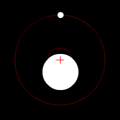
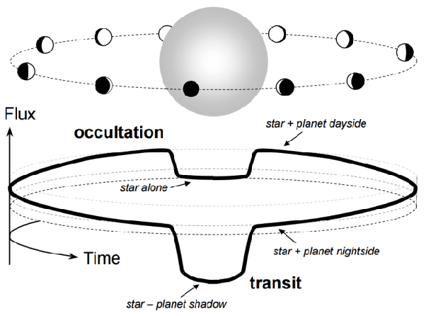
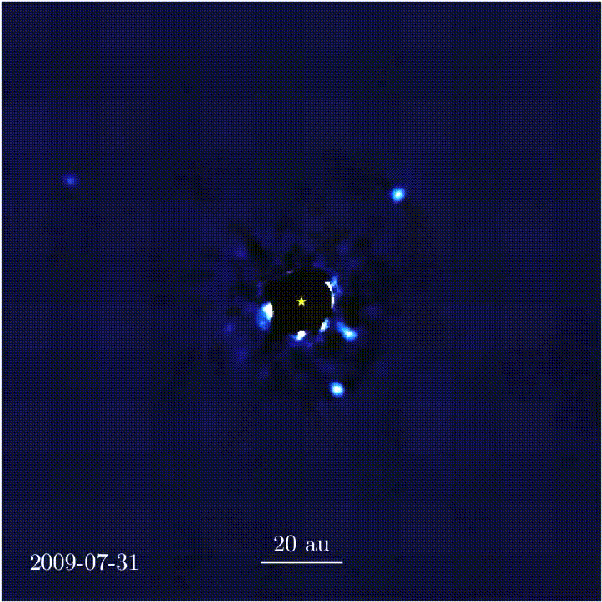

*Réponse publiée [sur Quora](https://fr.quora.com/Comment-a-t-on-d%C3%A9couvert-lexistence-dautres-plan%C3%A8tes-dans-notre-galaxie/answer/Dr-Goulu)*

Il existe plusieurs [Méthodes de détection des exoplanètes](w:)

Le plus "ancienne" est la [Méthode des vitesses radiales](w:) qui a permis les premières détections, notamment LA première en 1995, récompensée du Prix Nobel 2019.

Elle consiste à mesurer le mouvement d'une étoile sous l'influence d'une (ou plusieurs) planète(s). Ca paraît incroyable, mais on est aujourd'hui capables de mesurer des oscillations de la vitesse d'une étoile de 0.1 m/s, soit 0.36 km/h !

La méthode qui fournit le plus de résultats actuellement est la [méthode des transits](w:Transit_(astronomie)) qui détecte des variations de luminosité de l'étoile dues au passage de la planète devant elle, et aussi derrière !

Il faut remarquer qu'on ne peut actuellement détecter avec ces méthodes que les planètes qui orbitent dans un plan qui passe exactement (transits) ou à peu près (vitesses radiales) par nous, et qui sont assez grosses.

Avec nos instruments, des extraterrestres pourraient détecter Jupiter et Saturne, mais pas la Terre, Mars ou Vénus.

Depuis une dizaine d'années on a même été capables de "voir" quelques planètes directement avec des télescopes, en cachant leur étoile : ([List of directly imaged exoplanets - Wikipedia](w:en:List_of_directly_imaged_exoplanets) ) Sur ce film extraordinaire on voit clairement 4 exoplanètes tourner autour de [HR 8799](w:) en 6 ans. C'est à 129 années-lumière ! Et là on a une vision plutôt perpendiculaire au plan orbital.

