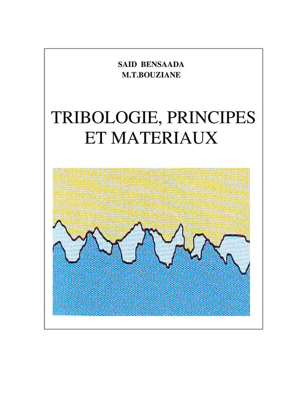

*Réponse publiée [sur Quora](https://fr.quora.com/Comment-expliquer-les-diff%C3%A9rences-dans-les-coefficients-de-frottement/answer/Dr-Goulu)*

La science du frottement s'appelle la [Tribologie](w:).

En cherchant une illustration que j'avais en mémoire je suis tombé sur la couverture de ce bouquin :

Vous y voyez le contact à l'échelle microscopique entre deux matériaux ayant des états de surface différents, avec éventuellement un lubrifiant entre les deux. Sauf aux points de contact, où la pression peut être telle qu'elle peut provoquer des micro-soudures à l'échelle atomique. (d'ailleurs on a fait beaucoup de progrès en tribologie grâce aux [Microscopes à force atomique](w:Microscope_à_force_atomique)qui permettent de "frotter" un seul atome sur une surface.)

Voilà, vous avez tous les ingrédients : rugosité, élasticité des aspérités, chimie des soudures et mécanique des fluides à l'échelle microscopique, il y en a pour tous les goûts dans ce domaine passionnant.
