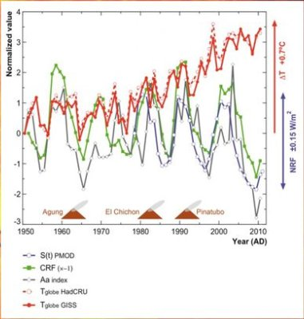

*Réponse publiée [sur Quora](https://fr.quora.com/Est-ce-que-le-climat-terrestre-peut-%C3%AAtre-d%C3%A9termin%C3%A9-sur-le-tr%C3%A8s-long-terme-par-la-disposition-des-continents-et-les-cons%C3%A9quences-de-leurs-d%C3%A9placements/answer/Dr-Goulu)*

Oui, mais ce n'est qu'un des facteurs. La composition de l'atmosphère est déterminante. Sans "effet de serre", tout gèle[[1]](#oBrrC) .

La circulation des courants océaniques, la présence des calottes glaciaires sur des continents (Antarctique) ou sous forme de glace flottante (Arctique) et la "largeur" des continents qui détermine le [Climat continental](w:) ont beaucoup plus d'importance que la plupart des facteurs cités par [le climatosceptique de service](https://fr.quora.com/profile/Jerome-Gontier) :

Et contrairement à lui, je cite mes sources :

[Activité solaire au plus bas : quel impact sur le climat?](https://www.rts.ch/meteo/10006698-activite-solaire-au-plus-bas-quel-impact-sur-le-climat-.html)

[Gondwana — Wikipédia](w:Gondwana)

Notes de bas de page

[[1]](#cite-oBrrC)[Planétologie/La température de surface des planètes](https://fr.wikibooks.org/wiki/Planétologie/La_température_de_surface_des_planètes#L'effet_de_serre)
