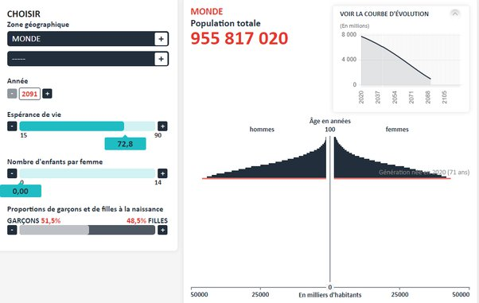

*Réponse publiée [sur Quora](https://fr.quora.com/Que-se-passerait-il-s-il-n-y-avait-plus-aucune-naissance-dans-le-monde-d%C3%A8s-demain-Quelles-seraient-les-cons%C3%A9quences/answer/Dr-Goulu)*

Essayez vous-même sur le [Simulateur de population](https://www.ined.fr/_modules/SimulateurPopulation/?lang=fr) de l'INED !

Au début on économise l'école, puis on se fait du souci pour les retraites, puis il n'y a plus de retraite du tout.

en 2091 la population passe à moins d'un milliard d'habitants, ayant tous entre 71 et 100 ans, servis par des robots sinon ils meurent de faim.

Disparition d'Homo Sapiens en 2120 environ.

