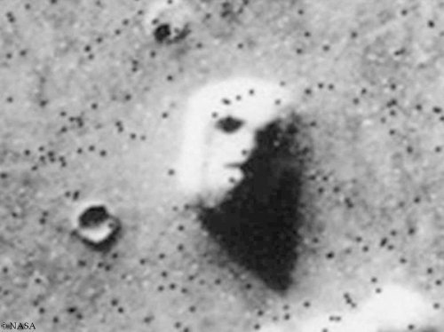

*Réponse publiée [sur Quora](https://fr.quora.com/Y-a-t-il-eu-des-moments-o%C3%B9-des-scientifiques-astronomes-ont-pens%C3%A9-avoir-vraiment-observ%C3%A9-une-forme-de-vie-extraterrestre-S-il-en-a-lesquels-demeurent-toujours-myst%C3%A9rieuses/answer/Dr-Goulu)*

Oui, il y a eu les [Canaux martiens](w:)auxquels beaucoup de scientifiques croyaient.

Il en reste des choses comme le fameux "visage sur Mars"

dont certains croient toujours qu'il est artificiel.

Notre cerveau est une merveilleuse machine de traitement biaisé de l'information.
