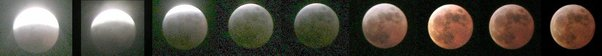

*Réponse publiée [sur Quora](https://fr.quora.com/Comment-la-lune-peut-elle-%C3%AAtre-parfaitement-s%C3%A9par%C3%A9e-en-deux-par-l-ombre-de-la-Terre-Pourquoi-cette-ombre-n-est-pas-constamment-arrondie/answer/Dr-Goulu)*

Quand la Terre fait de l'ombre à la Lune, ça s'appelle une [Éclipse lunaire](w:), et la ligne de séparation n'est jamais droite, même quand elle passe par le centre de la Lune (première photo de la séquence)

J'avais lu quelque part qu'un astronome avait mesuré ainsi le rayon de la Terre, mais je ne retrouve plus…
