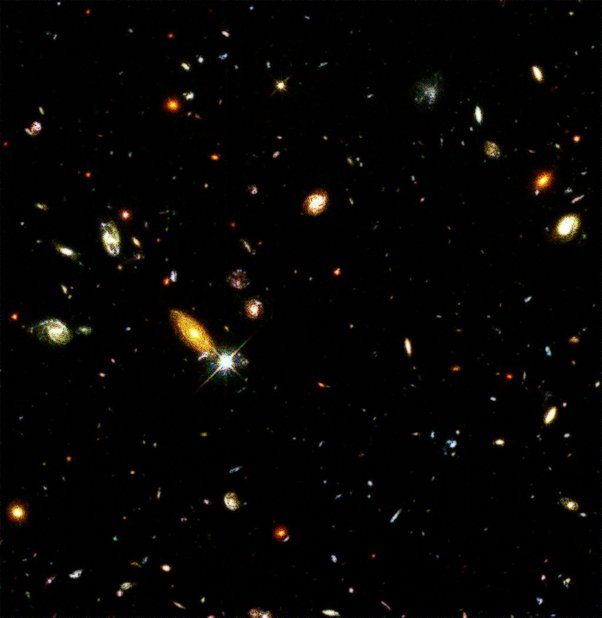

*Réponse publiée [sur Quora](https://fr.quora.com/Comment-les-scientifiques-recherchent-ils-des-%C3%A9toiles-et-des-galaxies-%C3%A0-des-millions-dann%C3%A9es-lumi%C3%A8re-de-l%C3%A0/answer/Dr-Goulu)*

On ne les recherche pas, on les trouve.

La [Galaxie d'Andromède](w:) est visible à l'oeil nu mais pendant des millénaires on ne savait pas ce que c'était.

En 1920, [Edwin Hubble](w:) (encore lui…) identifie des étoiles [variables céphéides](w:Céphéide) sur les photos astronomiques d'Andromède prises avec le télescope Hooker de 250 cm du Mont Wilson, le plus puissant de l'époque. Grâce à la [relation période-luminosité](w:) établie en 1912 par [Henrietta Leavitt](w:Henrietta_Swan_Leavitt), il établit que ces étoiles sont à 2.54 millions d'années lumière et confirme ainsi que la "nébuleuse" d'Andromède est en dehors de notre galaxie.

Et là ses jambes flageolent, il devient tout blanc et doit boire un whisky tellement l'Univers devient soudain monstrueux devant lui. Je ne sais pas si c'est historique, mais c'est ce que ça m'aurait fait, donc ça a du être comme ça…

Ensuite on a "juste" amélioré les télescopes, on en a mis dans l'espace, notamment un qui s'appelle "Hubble" et qu'un farfelu a braqué vers des zones du ciel toutes noires, où on ne voyait aucune étoile.

Le farfelu a obtenu des images comme celle-là, où tous les points sont des galaxies (sauf le plus blanc qui fait des [aigrettes de diffraction](w:) parce qu'il est quasi ponctuel, qui est quand même une étoile de notre galaxie…)

image du [Champ profond de Hubble — Wikipédia](w:Champ_profond_de_Hubble)

Alors les jambes du farfelu flageolent, il devient tout blanc et doit boire un whisky tellement l'Univers devient soudain encore plus monstrueux devant lui.

Je ne sais pas si c'est historique, mais c'est ce que ça m'aurait fait, donc ça a du être comme ça…

Et là des mecs détectent le [Fond diffus cosmologique](w:) … etc.
