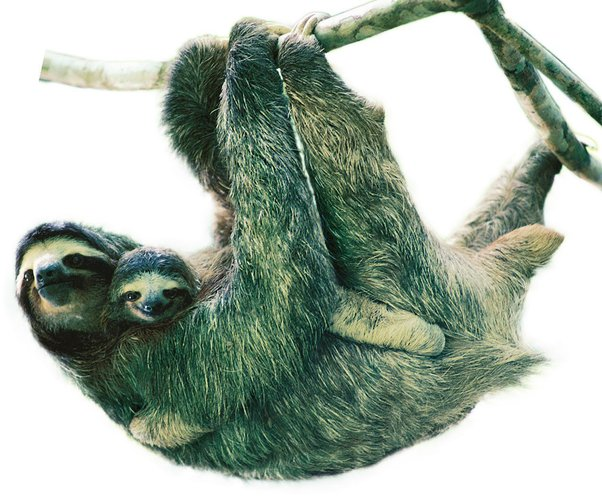

*Réponse publiée [sur Quora](https://fr.quora.com/Pourquoi-n-y-a-t-il-pas-de-mammif%C3%A8re-vert/answer/Dr-Goulu)*

et le paresseux alors ?

[Pourquoi le paresseux a-t-il le poil vert ?](https://www.sciencesetavenir.fr/animaux/pourquoi-le-paresseux-a-t-il-le-poil-vert_100348)

(bon, je suspecte que l'image a été un peu photoshoppée…)
