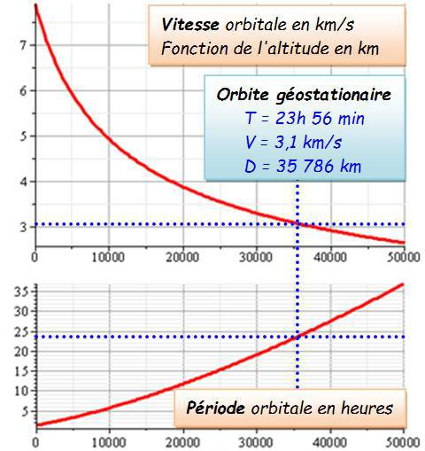

*Réponse publiée [sur Quora](https://fr.quora.com/Quelle-est-la-vitesse-de-d%C3%A9placement-des-satellites-en-orbite-autour-de-la-terre/answer/Dr-Goulu)*

$v_o=\sqrt{\mu \over{r}}$

où$\mu=GM$ est le [Paramètre gravitationnel standard](w:) qui vaut $398600 km^3.s^{-2}$

et r est le rayon de l'orbite (circulaire pour faire simple) mesuré depuis le centre de la Terre.

Le graphique donne ça :

Source : [Vitesse de libération](http://villemin.gerard.free.fr/aScience/Vitesse/Evasion.htm)

Question d'examen : pourquoi la période de l'orbite géostationnaire est 23h56 et pas 24h ?
