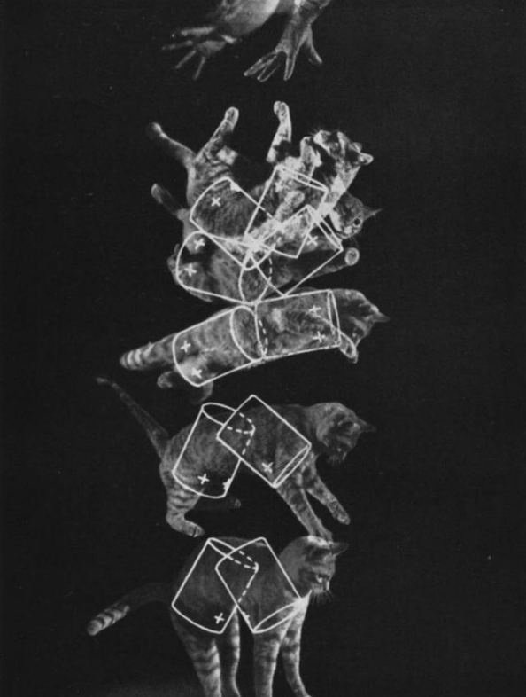

*Réponse publiée [sur Quora](https://fr.quora.com/Quels-sont-les-ph%C3%A9nom%C3%A8nes-surprenants-d%C3%A9j%C3%A0-captur%C3%A9s-par-des-scientifiques/answer/Dr-Goulu)*

Je dirais tous, et dans les deux sens.

1. Les phénomènes surprenants excitent la curiosité des scientifiques, et alors ils les "capturent".
2. Et certains phénomènes que les scientifiques "capturent" ne sont pas directement accessibles à nos sens, donc ils sont forcément surprenants.

Comme illustration du premier cat (sic…) je citerais l'étude de comment le chat retombe sur ses pattes :

Kane, T. R., & Scher, M. P. “[A Dynamical Explanation of the Falling Cat Phenomenon](http://pentagono.uniandes.edu.co/~jarteaga/geosem/taller7/minicursoJK-Uniandes/robotic examples/kane.pdf)“, 1969, Int. J. Solid Structures, 5, 663–670.

illustrée par cette merveilleuse image d'époque :

Du deuxième cas, je mentionnerais encore un truc qui tombe, mais cette fois construit à partir d'une bonne compréhension de la mécanique.

C'est une chaîne (à gauche) qui tombe "plus vite que la gravité" en heurtant une table que celle de droite qui tombe dans le vide[[1]](#Gksow) . Mais il faut une caméra haute vitesse pour le voir:

[https://youtu.be/i9gLi4pBgpk](https://youtu.be/i9gLi4pBgpk)

Anoop Grewal, Philip Johnson and Andy Ruina, "A chain that accelerates, rather than slows, due to collisions: how compression can cause tension" American Journal of Physics, Volume 79, Issue 7, pp. 723, July 2011 [http://ajp.aapt.org/resource/1/ajpias](https://www.youtube.com/redirect?event=video_description&v=i9gLi4pBgpk&q=http://ajp.aapt.org/resource/1/ajpias&redir_token=TWTYIof6KsDQNow1rR2PgcGAE2N8MTU5MTQ1NTIwMkAxNTkxMzY4ODAy)

Notes de bas de page

[[1]](#cite-Gksow)[Comment tomber plus vite que la gravité - Pourquoi Comment Combien](/2013/04/20/comment-tomber-plus-vite-que-la-gravite/#.XtpboUWiGCo)
