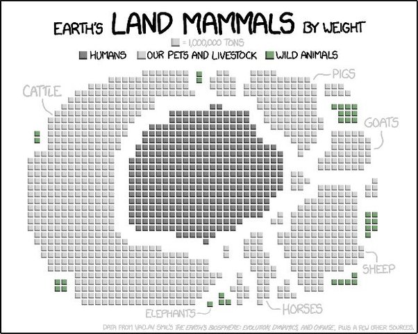

*Réponse publiée [sur Quora](https://fr.quora.com/Pensez-vous-que-si-une-esp%C3%A8ce-animale-%C3%A9tait-aussi-intelligente-et-%C3%A9volu%C3%A9-quun-%C3%AAtre-humain-si-d%C3%A9truirait-le-monde-autant-que-nous-le-faisons-Si-oui-laquelle-et-pourquoi/answer/Dr-Goulu)*

L'intelligence n'a rien à voir là dedans. Toutes les espèces se reproduisent au maximum, en consommant un maximum de ressources. C'est exactement ce que nous faisons, nous avons juste eu un peu plus de succès ces derniers milliers d'années.

Je vais vous raconter l'histoire des [Cyanobacteria](w:)qui vivaient il y a 2.4 milliards d'années dans les océans. Elles utilisaient la photosynthèse pour vivre, extrayant le carbone du CO2 abondant à l'époque. Elles avaient aussi besoin de fer pour produire leur chlorophylle, et il y en avait de grandes quantités dissous dans l'océan. Elles ont donc pu croître et multiplier tellement qu'elles ont rempli la Terre, enfin surtout la mer, consommé tout le fer et une bonne partie du CO2, et irrémédiablement pollué la planète avec leur déchet toxique : l'oxygène. Ça les a presque toutes tuées, mais sans la [Grande Oxydation](w:), nous ne serions pas là ni aucune espèce animale.

Je n'essaie pas de dire que la pollution c'est bien, mais que notre développement favorise certaines espèces au détriment d'autres.

Biomasse des animaux terrestres…

XKCD [Land Mammals](https://xkcd.com/1338/)
