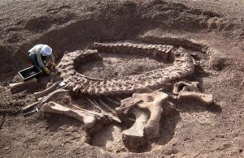

*Réponse publiée [sur Quora](https://fr.quora.com/Tous-les-sp%C3%A9cimens-de-dinosaures-expos%C3%A9s-en-laboratoire-ne-sont-que-des-r%C3%A9pliques-ils-pr%C3%A9tendent-donc-qu-il-n-existe-pas-de-fossiles-originaux-Comment-leur-prouver-que-les-fossiles-de/answer/Dr-Goulu)*

Les découvertes de gros fossiles sont photographiées et documentés dans des articles scientifiques. Exemple parmi beaucoup d'autres :

Spinophorosaurus nigerensis, holotype skeleton GCP-CV-4229 in situ during excavation in Republic of Niger. (Image credit: Remes K, Ortega F, Fierro I, Joger U, Kosma R, et al. (2009) PLoS ONE 4(9).)

[How to Discover a Dinosaur in 5 Easy Steps](https://www.livescience.com/amp/33460-how-dig-up-dinosaur.html)
