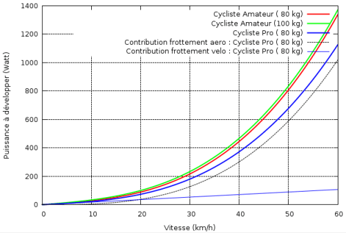

*Réponse publiée [sur Quora](https://fr.quora.com/Peut-on-calculer-une-puissance-cycliste-%C3%A0-partir-de-donn%C3%A9es-qui-ne-d%C3%A9pendent-pas-d-un-capteur-de-puissance/answer/Dr-Goulu)*

Vous pouvez la déduire approximativement de votre vitesse à plat à partir de ces courbes :

où l'on voit que l'ennemi #1, c'est le frottement dans l'air.

[Dopez votre vélo ! - Pourquoi Comment Combien](https://www.drgoulu.com/2010/06/06/dopez-votre-velo/#.Xt0KFkWiGCo)
