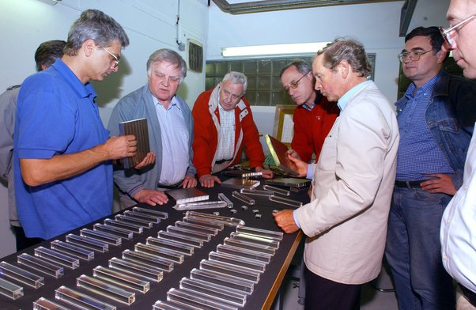

*Réponse publiée [sur Quora](https://fr.quora.com/Un-m%C3%A9tal-peut-il-%C3%AAtre-transparent/answer/Dr-Goulu)*

Oui s'il est cristallisé, parfois avec d'autres éléments.

Le CERN utilise dans ses détecteurs des centaines de cristaux de tungstate de plomb d'une transparence parfaite et d'une densité égale à celle du plomb.

J'en ai eu un entre les mains, c'est impressionnant, chacun pèse près de 10 kg.

Cependant le tungstanate de plomb n’est pas une molécule possédant des liaisons métalliques.

[ALICE crystals arrive at CERN – CERN Courier](https://cerncourier.com/a/alice-crystals-arrive-at-cern/)
