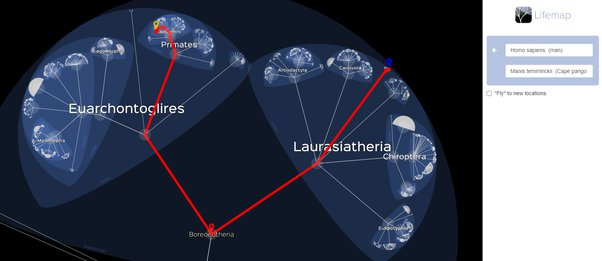

*Réponse publiée [sur Quora](https://fr.quora.com/L-homo-est-pass%C3%A9-par-des-stades-successives-pour-devenir-homo-sapiens-Du-min%C3%A9ral-au-v%C3%A9g%C3%A9tal-De-v%C3%A9g%C3%A9tal-%C3%A0-animal-et-de-l%C3%A0-il-a-acc%C3%A9d%C3%A9-%C3%A0-l-%C3%A9tape-humaine-Tout-au-long-de-cette/answer/Dr-Goulu)*

Les "stades successifs" ne sont pas une direction de l'évolution. Les platanes et les pangolins sont tout aussi évolués que nous.

Le [Boreoeutheria](w:) qui était votre ancêtre commun avec les pangolins était tout autant "potentiellement un être humain" que "potentiellement un pangolin"

[Lifemap](http://lifemap.univ-lyon1.fr/explore.html), c'est génial !
