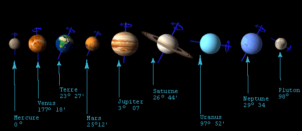
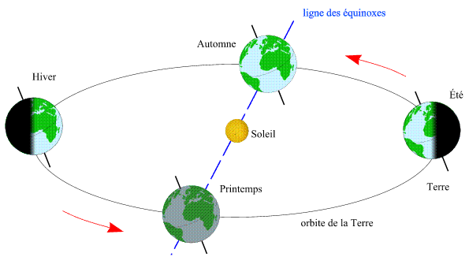

*Réponse publiée [sur Quora](https://fr.quora.com/Pourquoi-la-Terre-penche-t-elle-Quelles-seraient-les-cons%C3%A9quences-dune-position-verticale-sans-angulation-de-la-Terre-pendant-une-p%C3%A9riode-de-rotation/answer/Dr-Goulu)*

L'[Inclinaison de l'axe](w:) de la Terre date de sa formation, ou peu après. Il a été produit par les chocs des [planétésimaux](w:Planétésimal) qui se sont agglomérés pour former la planète, et probablement par l'impact avec [Théia](w:Théia_(impacteur)) qui a formé la Lune.

Comme on le voit sur cette illustration, les planètes ont toutes des inclinaisons différentes allant de près de 0° pour Mercure à 97° pour Uranus, ou même 177° pour Vénus qui tourne ainsi à l'envers des autres planètes. (On aurait aussi pu dire qu'elle a une inclinaison de -3° …)

Sans cet angle, la Terre n'aurait pas de saisons : en tournant autour du Soleil, l'inclinaison fait que la durée du jour, donc l'ensoleillement, varie

Essayez d'imaginer les saisons sur Neptune …
