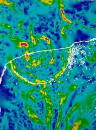
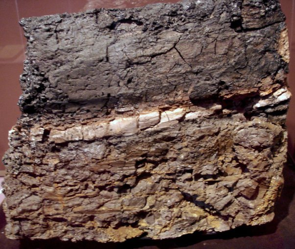

*Réponse publiée [sur Quora](https://fr.quora.com/Si-un-ast%C3%A9ro%C3%AFde-a-r%C3%A9ellement-tu%C3%A9-les-dinosaures-comme-le-pr%C3%A9tend-la-science-alors-quest-devenu-cet-%C3%A9norme-rocher-Pourquoi-ne-pouvons-nous-pas-le-voir-maintenant-Et-quelles-sont-les/answer/Dr-Goulu)*

Les autres réponses vous ont expliqué pourquoi la [Météorite](w:)(pas l'astéroïde…) a disparu lors de l'impact.

On ne voit plus de traces évidentes de cet impact car le [Cratère de Chicxulub](w:)est en partie sous-marin. On ne le voit que par des mesures gravimetriques:

Le cratère fait 180 km de diamètre et a été daté a 66'038'000 ans ± 11'000 ans par analyses radiométriques de haute précision en 2013.

On trouve tout autour de la Terre des traces géologiques de cet impact, notamment sous la forme d'une couche de la même datation contenant de l'iridium et du nickel, deux métaux typiques des météorites.

La voilà votre météorite, répandue en poussière tout autour du monde.

Cette couche contient aussi par endroits du quartz choqué et des micro diamants qui ne se produisent que sous des pressions extrêmes, et par endroits aussi des dépôts typiques d'un énorme tsunami.

Cette couche très reconnaissable s'appelle "couche K/T", ou "limite Crétacé /Tertiaire" :

Cette météorite a sans aucun doute déclenché un [Hiver d'impact](w:)de plusieurs décennies. Il n'est pas certain que ça ait suffi à zigouiller les gros dinosaures, mais ça a du aider, sans aucun doute.

Quelques petits ont survécu, on les appelle maintenant "oiseaux".
