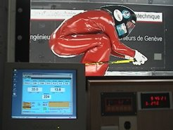

*Réponse publiée [sur Quora](https://fr.quora.com/Comment-mesurer-la-portance-et-la-tra%C3%AEn%C3%A9e-lors-dun-test-a%C3%A9rodynamique/answer/Dr-Goulu)*

avec des capteurs de force.

J'avais brièvement collaboré à un système de mesure destiné à l'entrainement des skieurs de kilomètre lancé en soufflerie à Genève :

[https://www.youtube.com/watch?v=...](https://www.youtube.com/watch?v=YVjMWC4_Qx0)

les capteurs sont dans la plateforme sur laquelle le skieur est fixé solidement (pour pas qu'il s'envole…)

L'écran du système de mesure est visible dans cette trop petite photo, mais on distingue quand même la vitesse (224 km/h) et deux valeurs, 33 et 13.8.

Je ne suis plus sur de laquelle est laquelle, mais de mémoire la grande (30) est la traînée, qui équilibre la composante du poids de [Patty Moll](http://scuba-dream.ch/kilometrelancehome.htm) dans le sens de la pente à 80% (environ 40 degrés), et la petite (13.8) est la force d'appui vertical, donc le poids moins la portance générée par le dos bombé de la skieuse.

Le but du jeu est de trouver la position qui minimise la traînée tout en gardant un appui positif … (sinon le skieur s'envole…)

[http://scuba-dream.ch/patty%20Sp...](http://scuba-dream.ch/patty Sport vFR3Seulp7LaSoufflerie.pdf)
