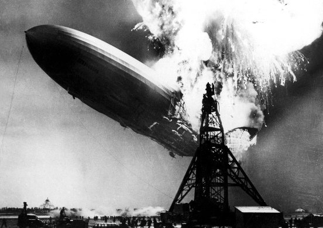

*Réponse publiée [sur Quora](https://fr.quora.com/Peut-on-cr%C3%A9er-de-l-eau-%C3%A0-partir-du-n%C3%A9ant-ou-de-quelque-chose-qui-n-a-strictement-rien-%C3%A0-avoir-avec-la-forme-finale-d-eau/answer/Dr-Goulu)*

On ne peut rien créer, encore moins à partir du néant (j’échange une petite fiole de néant contre une caisse de champagne, si jamais…)

L'eau est du monoxyde de dihydrogène ($H_2O$), donc elle se forme très facilement à partir de deux gaz, l'hydrogène et l'oxygène, et d'une petite étincelle.

Exemple :

Dirigeable[Hindenburg](w:LZ_129_Hindenburg)en train de produire de l'eau.
