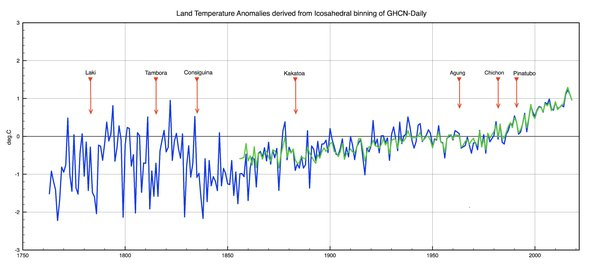

*Réponse publiée [sur Quora](https://fr.quora.com/L-%C3%A9ruption-imminente-du-volcan-Grimsv%C3%B6tn-en-Islande-peut-elle-avoir-un-effet-sur-le-r%C3%A9chauffement-climatique/answer/Dr-Goulu)*

Bien sur. Les petites éruptions causent de légers refroidissements causés par les poussières et le SO2, et les grosses des [Hiver volcanique](w:)s qui peuvent durer plusieurs mois, et même plusieurs années.

D'ailleurs les mesures de températures montrent des baisses nettes lors des éruptions, mais l'effet est très temporaire.:

[19th Century Volcanic Eruptions](http://clivebest.com/blog/?p=8487)
