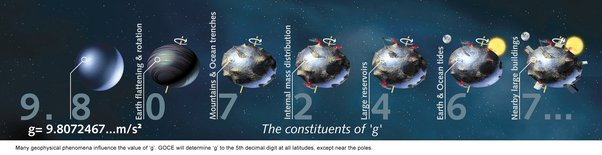

*Réponse publiée [sur Quora](https://fr.quora.com/Est-ce-quun-humain-pourrait-ressentir-des-anomalies-gravitationnelles-sur-Terre/answer/Dr-Goulu)*

Non, elles sont beaucoup trop faibles.

- Comme vous le voyez dans cette jolie figure, l'aplatissement de la terre et la "force centrifuge" causée par sa rotation influencent g pour environ 1%. Donc si vous passez de l'équateur au pôle nord sans manger, votre balance vous dira que vous aurez "grossi" de 1% de votre poids, mais je doute que vous puissiez le "ressentir".
- les montagnes et les fosses marines pour 1 millième
- la constitution du sous-sol pour 1 /10'000
- les cavernes pour 1/100'000èeme (donc la Terre n'est pas creuse, désolé…)
- les marées (= le déplacement de matière causée par elles) de 1 millionième
- et les gros bâtiments genre pyramide de Khéops ou barrage de la Grande Dixence, 1/10'000'000

Donc voilà, si vous pesez 60 kg et qu'une puce de 6 milligrammes vous saute dessus et que vous le sentez par une subite augmentation de pression sous vos pieds, vous serez aussi sensible que les [Gravimètres actuels](w:Gravimètre)

[Source:. Champ de gravité / champ de pesanteur local](https://phychym.wordpress.com/2015/03/05/c-c-7-3-champ-de-gravite/)
