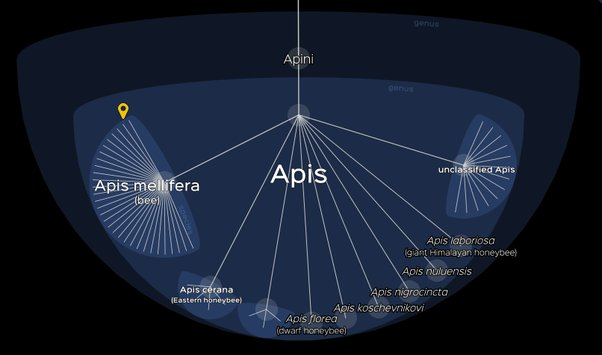
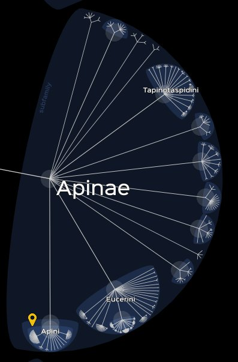

*Réponse publiée [sur Quora](https://fr.quora.com/Comment-est-ce-que-les-esp%C3%A8ces-apparaissent-Comme-par-exemple-les-abeilles-comment-est-ce-possible-quelles-aient-une-sp%C3%A9cification/answer/Dr-Goulu)*

C'est le principe même de l'[évolution](w:Évolution_(biologie)) : les populations distinctes s'adaptent à leur environnement jusqu'à ne plus être interfécondes.

Pour les abeilles, le terme est équivoque car on l'utilise pour plusieurs [Taxons :](w:Taxon)

1. le genre [Apis](w:Apis_(insecte)) qui comprend les 9 espèces qui produisent beaucoup de miel, dont [Apis mellifera](w:). C'est l'espèce domestique la plus utilisée en apiculture, qui a [28 sous-espèces](w:Apis_mellifera) interfécondes correspondant principalement à des régions géographiques
2. la sous-famille des [Apinae](w:) qui comprend les abeilles « vraies ». Les différentes espèces sont le plus souvent sociales et forment des colonies et les individus possèdent un appareil de récolte du pollen formé d'une brosse à la face intérieure des métatarses des pattes postérieures et d'une corbeille à la face externe des tibias des pattes postérieures.
3. la familles des [Apidae](w:), qui regroupe plus de 5700 espèces. Les premières formes sociales élaborées et stables sont apparues dans cette famille il y a au moins 87 millions d'années, Les organisations les plus complexes sont apparues dans la tribu des [Meliponini](w:) il y a plus de 55 millions d'années et dans la tribu des [Apini](w:) il y a une vingtaine de millions d'années.

Des dizaines de millions d'années, donc de générations, c'est amplement suffisant pour que des populations d'abeilles se soient adaptées aux fleurs de leur région, à la météo, aux parasites etc. de nombreuses manières différentes.

Je ne résiste pas au plaisir de vous montrer 3 niveaux de zoom sur [Lifemap](http://lifemap.univ-lyon1.fr/explore.html) :

L'évolution, c'est BEAU !
