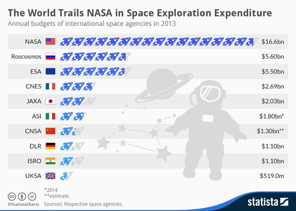
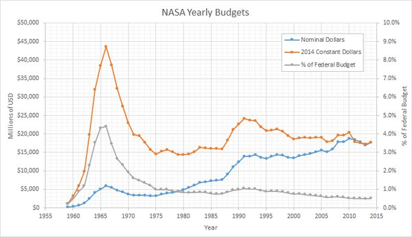

*Réponse publiée [sur Quora](https://fr.quora.com/Quels-sont-les-ressorts-qui-fondent-les-succ%C3%A8s-de-la-technologie-de-l-exploration-spatiale-am%C3%A9ricaine-Seule-nation-a-avoir-poser-des-hommes-sur-la-lune-et-%C3%A0-avoir-poser-des-robots-viables/answer/Dr-Goulu)*

Le pognon. = nombre de gens qui travaillent là dessus.

et c'est pas nouveau :

