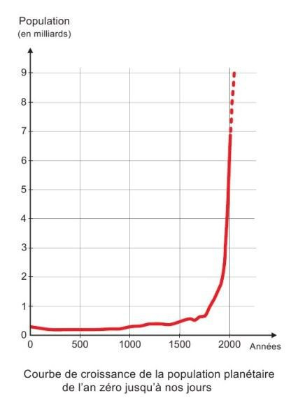

*Réponse publiée [sur Quora](https://fr.quora.com/En-quelle-ann%C3%A9e-y-a-il-eu-le-plus-de-mort-sur-terre/answer/Dr-Goulu)*

L'année passée.

Avec 7.8 milliards d'êtres humains sur Terre, il y a environ 57 millions de morts par an. ( [Worldometer - real time world statistics](https://www.worldometers.info/) )

En 1940 la population mondiale était de 2.3 milliards d'habitants, donc la mortalité "normale" a été d'environ 57*2.3/7.8 = 17 millions de morts.

La seconde guerre mondiale a tué 70 millions de personnes entre 1939 et 1945, disons 14 millions de personnes par an en plus. Total 31 millions de morts par année, soit beaucoup moins que l'année passée.

Vous pouvez faire le même raisonnement pour la première guerre mondiale, pour la peste noire ou n'importe quel événement dramatique de l'histoire humaines, aucun ne sera plus mortel que la vie.

