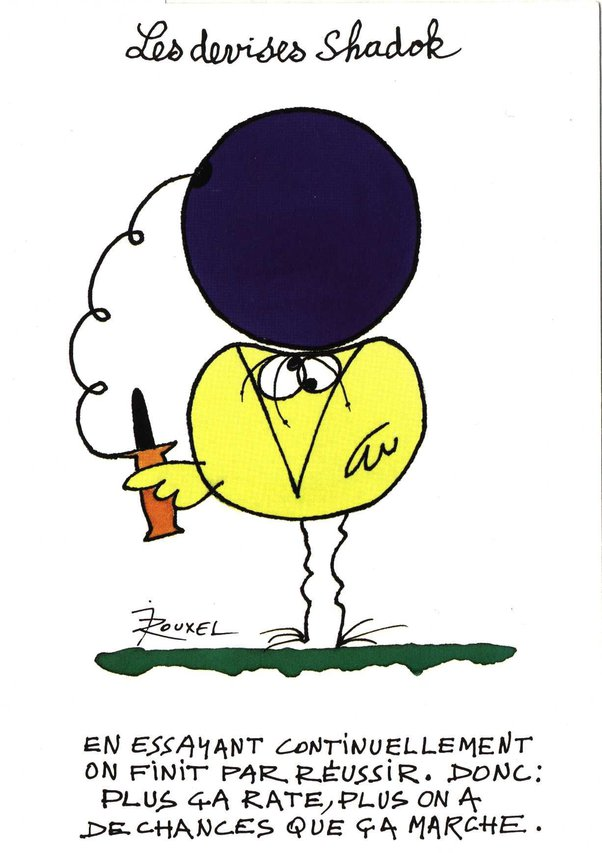

*Réponse publiée [sur Quora](https://fr.quora.com/Est-ce-que-les-%C3%A9lectrons-libres-ne-serait-il-pas-comme-des-trous-noirs-dans-l-infiniment-petit-de-notre-corps-et-programm%C3%A9s-pour-nous-faire-vieillir/answer/Dr-Goulu)*

Non.

La science n'avance pas comme ça :

