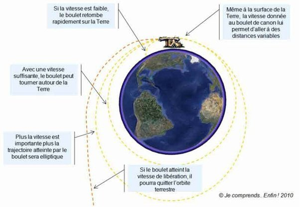

*Réponse publiée [sur Quora](https://fr.quora.com/Pourquoi-la-lune-tourne-t-elle-autour-de-la-terre-sans-y-tomber/answer/Dr-Goulu)*

Mais elle tombe, elle n'arrête pas de tomber perpétuellement à côté de la Terre car elle a une vitesse tangentielle.

C'est ce qu'avait compris Newton en 1728 avec son idée du [Canon de Newton](w:)

