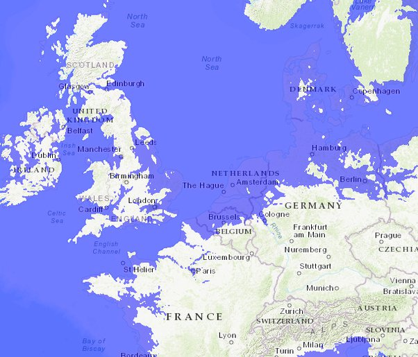

*Réponse publiée [sur Quora](https://fr.quora.com/Que-deviendrait-la-plan%C3%A8te-si-les-deux-p%C3%B4les-subissent-une-fonte-totale-de-leurs-glaces/answer/Dr-Goulu)*

La planète irait bien, merci pour elle.

Mais nous ne ferions pas les malins, avec un niveau des océans surélevé d'environ 67m. Enfin surtout vous …

[Flood Map: Elevation Map, Sea Level Rise Map](https://www.floodmap.net/?ll=53.225768,-1.625977&z=5&e=67)
